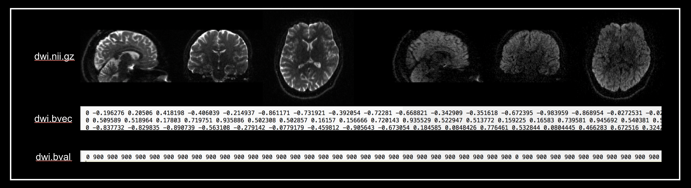
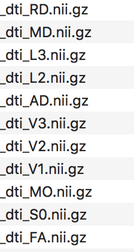

# <font size=6><br>_**dpreproc.sh</br></font> <font size=3>(d)wi (preproc)essing pipeline shell script**_</font>


## Description
+ Single DWI dataset required
+ The script is the initial version of the script
+ The script dose not support spatial registration yet
+ Outputs are dwi derieved measurement maps (FA, MD, etc)
+ The script supports <b>_bash_</b> and <b>_MacOS_</b>

## Input dataset


## Install requirements
### &nbsp;&nbsp;&nbsp;_FSL_
&nbsp;&nbsp;&nbsp;&nbsp;You need to install [FSL](https://fsl.fmrib.ox.ac.uk/fsl/fslwiki) to use this script.<br>

### &nbsp;&nbsp;&nbsp;_MRtrix_
&nbsp;&nbsp;&nbsp;&nbsp;You need to install [MRtrix3](https://www.mrtrix.org/) to use this script.<br>

### &nbsp;&nbsp;&nbsp;_ANTs_
&nbsp;&nbsp;&nbsp;&nbsp;You need to install [ANTs](https://github.com/ANTsX/ANTs) to use this script.<br>


## Usage
+ <b>Run in Terminal</b>
```
dpreproc.sh --dwi=dwi.nii.gz --readT=0.0718
```
+ <b>Help</b>
```
dpreproc.sh -help
```

## Outputs
* <font size=4>_DWI derieved measurement maps_</font>



* <font size=4>_FA modulated V1 map figures_</font>


## Version history
+ Version 0.1: the script release (2021.07.16)

## _Contact for Feedback and Bug Reports_
_Uksu, Choi (qtwing@naver.com)_
